# fast-neural-style

This is the code for the paper

**[Perceptual Losses for Real-Time Style Transfer and Super-Resolution](http://cs.stanford.edu/people/jcjohns/eccv16/)**
<br>
[Justin Johnson](http://cs.stanford.edu/people/jcjohns/),
[Alexandre Alahi](http://web.stanford.edu/~alahi/),
[Li Fei-Fei](http://vision.stanford.edu/feifeili/)
<br>
Presented at [ECCV 2016](http://www.eccv2016.org/)

The paper builds on
[A Neural Algorithm of Artistic Style](https://arxiv.org/abs/1508.06576)
by Leon A. Gatys, Alexander S. Ecker, and Matthias Bethge by training
feedforward neural networks that apply artistic styles to images.
After training, our feedforward networks can stylize images
**hundreds of times faster** than the optimization-based method presented
by Gatys et al.

This repository also includes an implementation of instance normalization as
described in the paper [Instance Normalization: The Missing Ingredient for Fast Stylization](https://arxiv.org/abs/1607.08022)
by Dmitry Ulyanov, Andrea Vedaldi, and Victor Lempitsky. This simple trick
significantly improves the quality of feedforward style transfer models.

Stylizing this image of the Stanford campus at a resolution of 1200x630
takes **50 milliseconds** on a Pascal Titan X:

<div align='center'>
  
  
  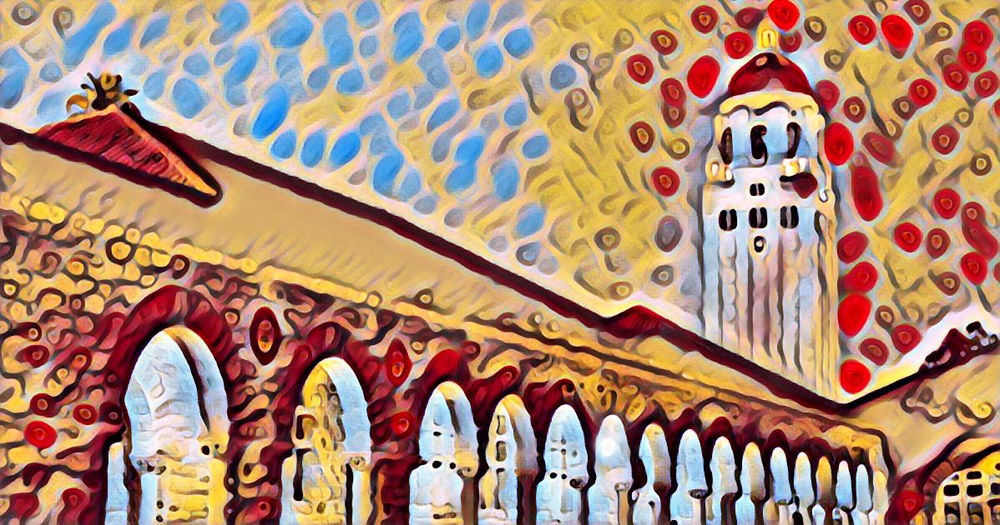
</div>

In this repository we provide:
- The style transfer models [used in the paper](#models-from-the-paper)
- Additional models [using instance normalization](#models-with-instance-normalization)
- Code for [running models on new images](#running-on-new-images)
- A demo that runs models in [real-time off a webcam](#webcam-demo)
- Code for [training new feedforward style transfer models](doc/training.md)
- An implementation of [optimization-based style transfer](#optimization-based-style-transfer)
  method described by Gatys et al.

If you find this code useful for your research, please cite

```
@inproceedings{Johnson2016Perceptual,
  title={Perceptual losses for real-time style transfer and super-resolution},
  author={Johnson, Justin and Alahi, Alexandre and Fei-Fei, Li},
  booktitle={European Conference on Computer Vision},
  year={2016}
}
```

## Setup
All code is implemented in [Torch](http://torch.ch/).

First [install Torch](http://torch.ch/docs/getting-started.html#installing-torch), then
update / install the following packages:

```bash
luarocks install torch
luarocks install nn
luarocks install image
luarocks install lua-cjson
```

### (Optional) GPU Acceleration

If you have an NVIDIA GPU, you can accelerate all operations with CUDA.

First [install CUDA](https://developer.nvidia.com/cuda-downloads), then
update / install the following packages:

```bash
luarocks install cutorch
luarocks install cunn
```

### (Optional) cuDNN

When using CUDA, you can use cuDNN to accelerate convolutions.

First [download cuDNN](https://developer.nvidia.com/cudnn) and copy the
libraries to `/usr/local/cuda/lib64/`. Then install the Torch bindings for cuDNN:

```bash
luarocks install cudnn
```

### Pretrained Models
Download all pretrained style transfer models by running the script

```bash
bash models/download_style_transfer_models.sh
```

This will download ten model files (~200MB) to the folder `models/`.

## Models from the paper
The style transfer models we used in the paper will be located in the folder `models/eccv16`.
Here are some example results where we use these models to stylize this
image of the Chicago skyline with at an image size of 512:

<div align='center'>
  
</div>


<br>
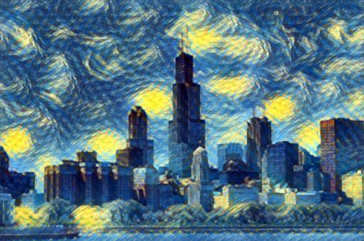
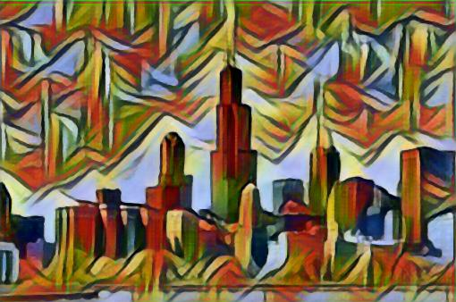
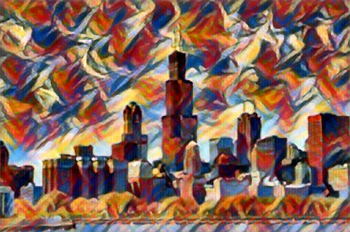
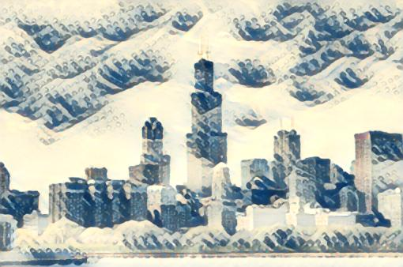

## Models with instance normalization
As discussed in the paper
[Instance Normalization: The Missing Ingredient for Fast Stylization](https://arxiv.org/abs/1607.08022)
by Dmitry Ulyanov, Andrea Vedaldi, and Victor Lempitsky, replacing batch
normalization with instance normalization significantly improves the quality
of feedforward style transfer models.

We have trained several models with instance normalization; after downloading
pretrained models they will be in the folder `models/instance_norm`.

These models use the same architecture as those used in our paper, except with
half the number of filters per layer and with instance normalization instead of
batch normalization. Using narrower layers makes the models smaller and faster
without sacrificing model quality.

Here are some example outputs from these models, with an image size of 1024:

<div align='center'>
  
  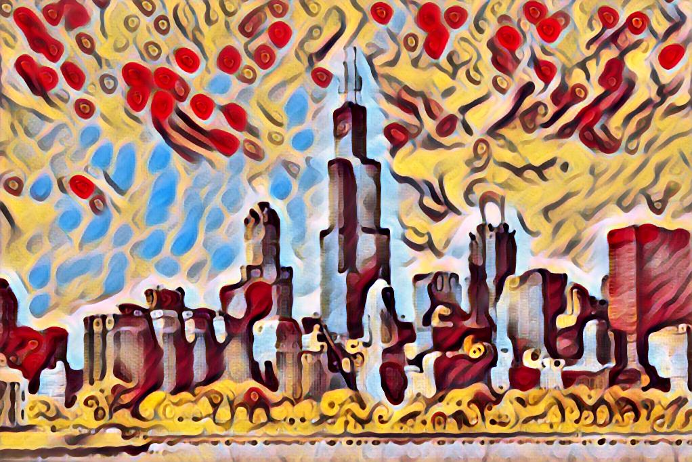
  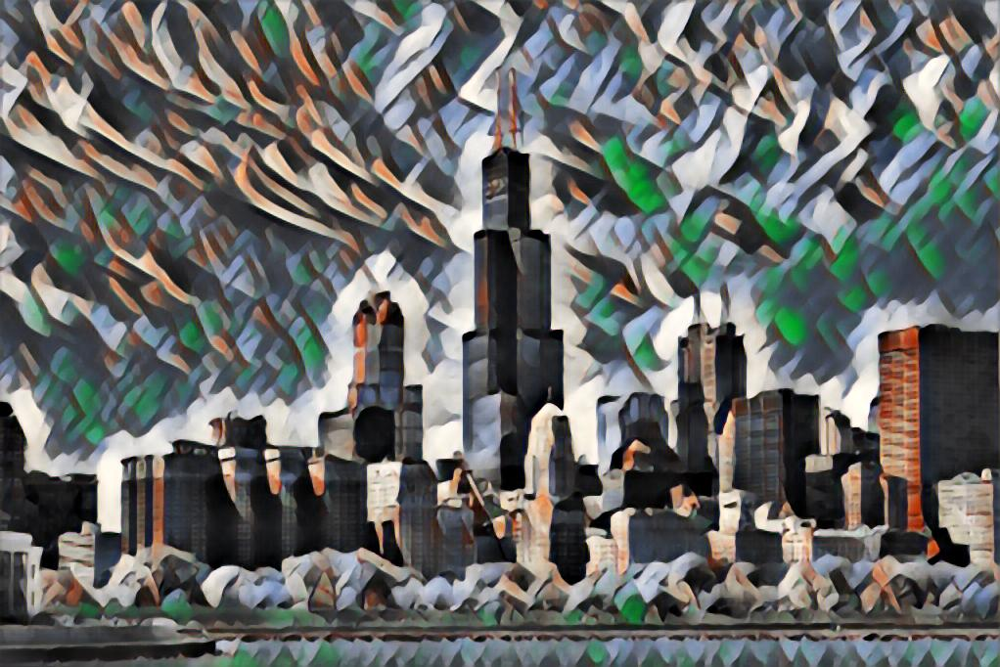
  
  <br>
  
  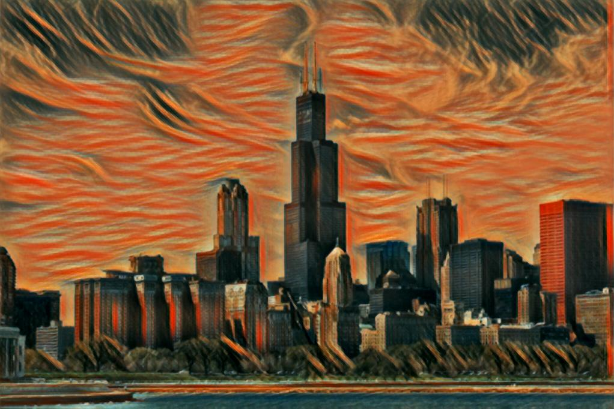
  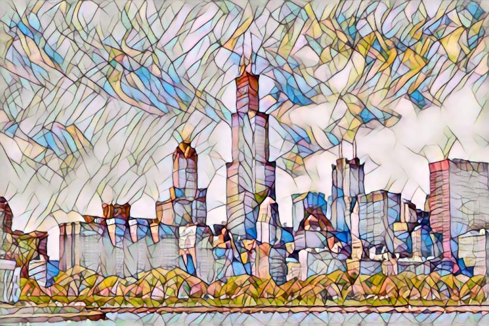
  
  <br>
  
  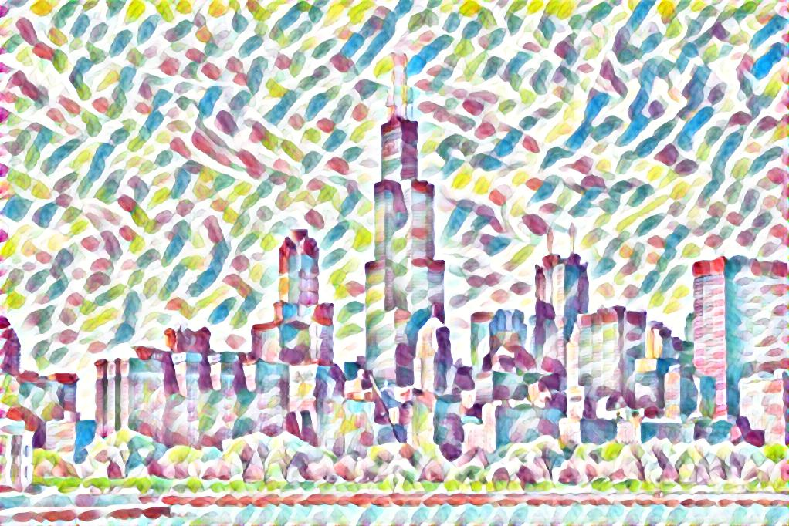
  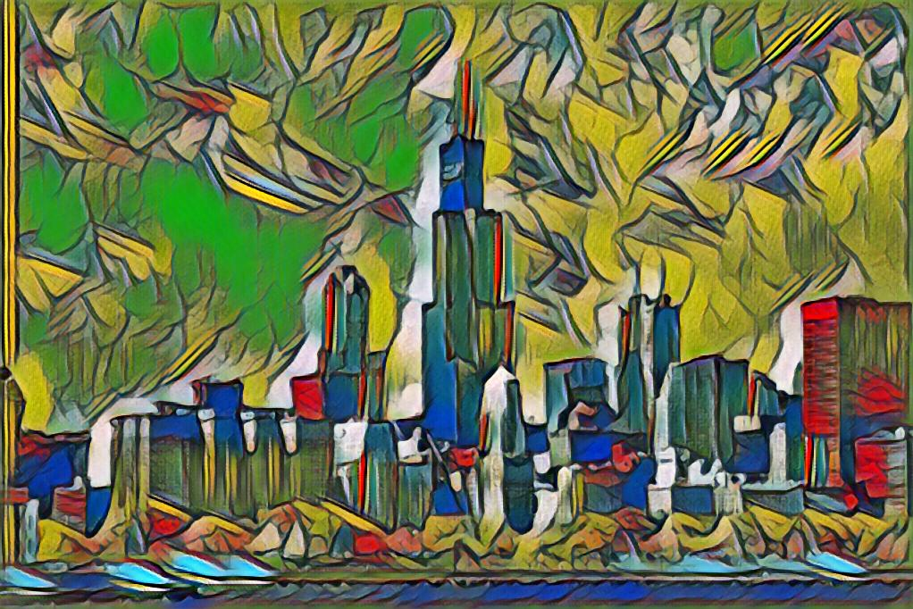
  
</div>

## Running on new images
The script `fast_neural_style.lua` lets you use a trained model to stylize new images:

```bash
th fast_neural_style.lua \
  -model models/eccv16/starry_night.t7 \
  -input_image images/content/chicago.jpg \
  -output_image out.png
```

You can run the same model on an entire directory of images like this:

```bash
th fast_neural_style.lua \
  -model models/eccv16/starry_night.t7 \
  -input_dir images/content/ \
  -output_dir out/
```

You can control the size of the output images using the `-image_size` flag.

By default this script runs on CPU; to run on GPU, add the flag `-gpu`
specifying the GPU on which to run.

The full set of options for this script is [described here](doc/flags.md#fast_neural_stylelua).


## Webcam demo
You can use the script `webcam_demo.lua` to run one or more models in real-time
off a webcam stream. To run this demo you need to use `qlua` instead of `th`:

```bash
qlua webcam_demo.lua -models models/instance_norm/candy.t7 -gpu 0
```

You can run multiple models at the same time by passing a comma-separated list
to the `-models` flag:

```bash
qlua webcam_demo.lua \
  -models models/instance_norm/candy.t7,models/instance_norm/udnie.t7 \
  -gpu 0
```

With a Pascal Titan X you can easily run four models in realtime at 640x480:

<div align='center'>
  
</div>

The webcam demo depends on a few extra Lua packages:
- [clementfarabet/lua---camera](https://github.com/clementfarabet/lua---camera)
- [torch/qtlua](https://github.com/torch/qtlua)

You can install / update these packages by running:

```bash
luarocks install camera
luarocks install qtlua
```

The full set of options for this script is [described here](doc/flags.md#webcam_demolua).


## Training new models

You can [find instructions for training new models here](doc/training.md).

## Optimization-based Style Transfer

The script `slow_neural_style.lua` is similar to the
[original neural-style](https://github.com/jcjohnson/neural-style), and uses
the optimization-based style-transfer method described by Gatys et al.

This script uses the same code for computing losses as the feedforward training
script, allowing for fair comparisons between feedforward style transfer networks
and optimization-based style transfer.

Compared to the original [neural-style](https://github.com/jcjohnson/neural-style),
this script has the following improvements:

- Remove dependency on protobuf and [loadcaffe](https://github.com/szagoruyko/loadcaffe)
- Support for many more CNN architectures, including ResNets

The full set of options for this script is [described here](doc/flags.md#slow_neural_stylelua).

## License

Free for personal or research use; for commercial use please contact me.

